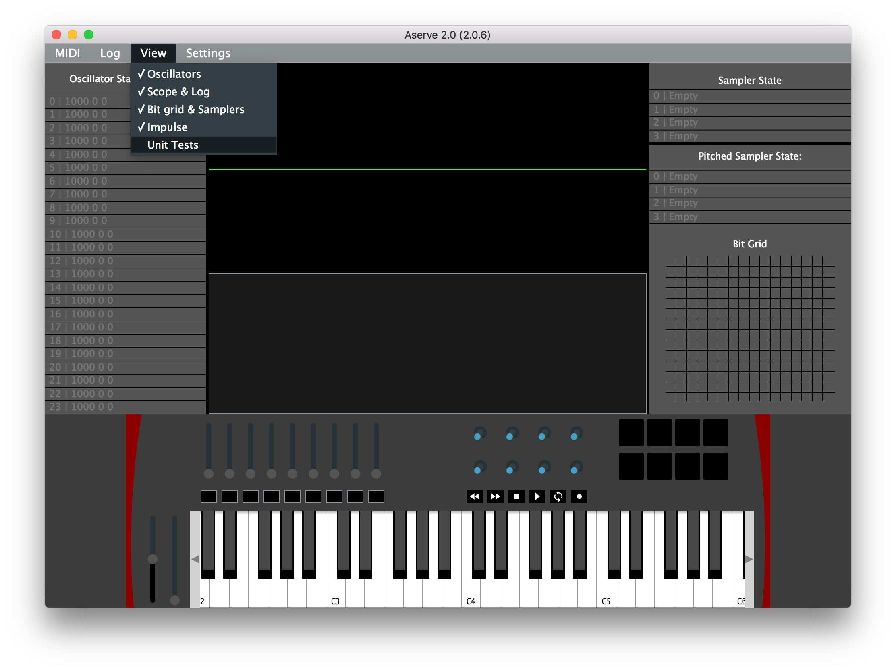
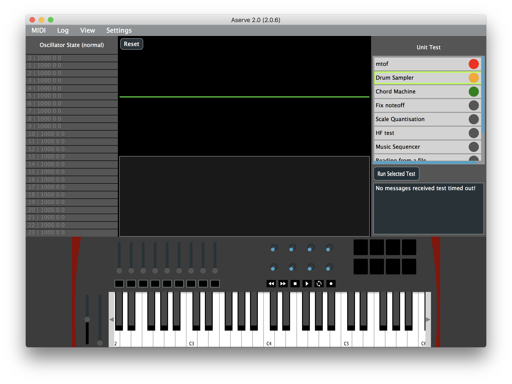
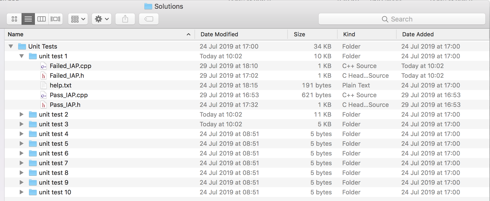

# Unit Tests

Unit tests are usually automated checks designed to check that a piece of code (the "unit" under test) performs a specific task exactly as designed.

Testing code is part of good software development practice.

Aserve can automatically send messages to your iapProj code in xcode,  checking to see if your program responds in the expected way for certain milestone exercises in the tutorials.

This document outlines each of unit tests available with details of inputs and expected outcomes.

# Setup

To view the unit test panel in Aserve select it from the dropdown menu (it is hidden by default).



Once open you should see the unit test panel appear on the right hand side.



# Description

Each of the tests are listed in the scrolling menu, the coloured circle depicts the current state of each test. Red means the test failed, orange means the test is currently running and green means the test has passed. To run a test simply select it from the menu and then hit the *Run Selected Test* button. Error messages will be shown in the text box below.

# Saving

Once a test has been run the solution to the test will be copied from your Xcode project to the Solutions/Unit Tests folder inside your project folder. The files are prepended with *Failed* if the test fails or *Pass* if they pass. When re-opening Aserve, this folder is scanned and the interface updates accordingly, keeping track of each test. It is important that you **do not** manually edit the files in this folder. You should ensure that you keep a backup copy of each unit test that has passed inside codebook.



## File paths

There may be occasions where you need to specify the location of your project and Solutions folder. To do this open settings -> unit test setup (from the dropdown menu). **However you should speak to a member of staff before changing any of the settings - as the project should be setup automatically for you.**


# The Tests

The table bellow outlines each test and the tutorial exercise they are based on. Please note that some tutorials will need adapting for the purpose of validating the unit tests.


| Number | Unit Test Name | Exercise Number | Exercise Name |
| --- | --- | --- | --- |
| 1 | Midi Note to Frequency | 3.3 | <a href="../Tutorials/Part%201/3%20-%20Processing%20MIDI%20Input.md">Our first monophonic synthesizer</a> |
| 2 | Drum Sampler | 4.4 |  <a href="../Tutorials/Part%201/4%20-%20Flow%20Control.md">Fixing the drum sampler </a> |
| 3 | Chord Machine | 5.3 | <a href="../Tutorials/Part%201/5%20-%20Functions.md">Chord Machine </a> |
| 4 | Monophonic Synth | 6.4 | <a href="../Tutorials/Part%201/6%20-%20Functions%20II.md">noteoff</a> |
| 5 | Scale Quantisation | 7.4 | <a href="../Tutorials/Part%201/7%20-%20Switch%20and%20Combinational%20Logic.md">Scale Quantisation</a> |
| 6 | High Frequency Test Loop | 8.3 | <a href="../Tutorials/Part%201/8%20-%20Loops.md"> High frequency test </a> |
| 7 | Music Sequencer | 11.3 | <a href="../Tutorials/Part%202/11%20-%20Vector.md"> Exercise 3: Building a music sequencer </a> |
| 8 | Reading From a File | 14.2 | <a href="../Tutorials/Part%202/14%20-%20Files%20and%20String%20Manipulation.md"> Synthesize file contents </a> |
| 9 | Write to a File | 14.3 | <a href="../Tutorials/Part%202/14%20-%20Files%20and%20String%20Manipulation.md"> Writing to our file
 </a> |
 | 10 | Sorting | 13.4 | <a href="../Tutorials/Part%202/13%20-%20Constants%20and%20Algorithms%20II.md"> Sort, Reverse, Randomize </a> |


# Test 1: Midi Note to Frequency
*Tests: <a href="../Tutorials/Part%201/3%20-%20Processing%20MIDI%20Input.md">Exercise 3.3</a>*

This unit test tests that you have correctly implemented the equation for converting note numbers into oscillator frequencies. The test will iteratively output MIDI note numbers from 0-127 and expect the oscillator on channel 0 to be updated accordingly. 

| # | Input From Aserve | Output expected from project |
| --- | --- | --- |
| 1 | MIDI notes from 0 - 127 | Switch on Oscillator 0 with correct frequency | 

# Test 2: Drum Sampler
*Tests: <a href="../Tutorials/Part%201/4%20-%20Flow%20Control.md">Exercise 4.4</a>*

This unit test tests that you have correctly implemented exercise 4.4. The test will simulate pushing each of the top 4 drum pads on the impulse keyboard. The sample should only be triggered when the pad is pushed down (velocity greater then 0) but not when the pad is released (velocity value is 0).

| # | Input From Aserve | Output expected from project |
| --- | --- | --- |
| 1 | Note on MIDI message with note number 67 | play sample channel 0 | 
| 2 | Note off MIDI message with note number 67 | nothing | 
| 3 | Note on MIDI message with note number 69 | play sample channel 1 | 
| 4 | Note off MIDI message with note number 69 | nothing | 
| 5 | Note on MIDI message with note number 71 | play sample channel 2 | 
| 6 | Note off MIDI message with note number 71 | nothing | 
| 7 | Note on MIDI message with note number 72 | play sample channel 3 | 
| 8 | Note off MIDI message with note number 72 | nothing | 


# Test 3: Chord Machine
*Tests: <a href="../Tutorials/Part%201/5%20-%20Functions.md">Exercise 5.3</a>*

This unit test tests that you have correctly implemented exercise 5.3. This test will simulate pushing each of the top 4 drum pads on the impulse keyboard. The first 3 pads should play major chords, and the 4th pad a minor chord. Each note of the chord must be played on a different channel at the same time. See the below table for the exact expected chords.

| # | Input From Aserve | Output expected from project |
| --- | --- | --- |
| 1 | Note on MIDI message with note number 67 | Output MIDI notes 60 64 67 (C major) as frequencies on the first 3 oscillator channels | 
| 2 | Note on MIDI message with note number 69 | Output MIDI notes 65 69 72 (F major) as frequencies on the first 3 oscillator channels | 
| 3 | Note on MIDI message with note number 71 | Output MIDI notes 67 71 74 (G major) as frequencies on the first 3 oscillator channels | 
| 4 | Note on MIDI message with note number 72 | Output MIDI notes 57 60 64 (A minor) as frequencies on the first 3 oscillator channels | 


# Test 4: Fix noteoff
*Tests: <a href="../Tutorials/Part%201/6%20-%20Functions%20II.md">Exercise 6.4</a>*

This unit test tests that you have correctly implemented the expected behaviour for note off messages for a monophonic synthesiser. The oscillator should always play note on messages when received but only switch off when the note number of a note off messages matches the frequency of the oscillator that is currently playing.

| # | Input From Aserve | Output expected from project |
| --- | --- | --- |
| 1 | Note on MIDI message a | Switch on Oscillator 0 with correct frequency and amplitude | 
| 2 | Note on MIDI message b | Update Oscillator 0 with correct frequency and amplitude | 
| 3 | Note off MIDI message a | Nothing as oscillator is playing note b |
| 4 | note off MIDI message b | Switch off Oscillator 0 as note off number matches the playing oscillator |


# Test 5: Scale Quantization
*Tests: <a href="../Tutorials/Part%201/7%20-%20Switch%20and%20Combinational%20Logic.md">Exercise 7.4</a>*

This unit test tests that you have correctly implemented the major scale quantization function. All notes should be quantised to the C major scale (white keys) this means each time a black key is pressed the corresponding note is transposed by 1 semitone (value increased by 1). The test will iteratively output MIDI note numbers from 0-127 and expect the oscillator on channel 0 to be updated accordingly. 

| # | Input From Aserve | Output expected from project |
| --- | --- | --- |
| 1 | MIDI notes from 0 - 127 | Switch on Oscillator 0 with correct frequency - all frequencies should correspond to notes in the C-major scale | 


# Test 6: High Frequency Test
*Tests: <a href="../Tutorials/Part%201/8%20-%20Loops.md">Exercise 8.3</a>*

This unit test tests that you have correctly implemented a looping high frequency test. This unit test will require you to adapt one of your solutions from exercise 8. When you run this unit test Aserve will send out a modwheel control change message. When this happens you should start a high frequency test. This test should start with a frequency value of 20hz and increment the frequency value by 17 on each loop increment. Note that you should sleep for 10ms on each loop increment. The test should only run while the frequency value is less then 17,300 hz. Note you may place code in either the modwheel callbacj function, or in your run function.

| # | Input From Aserve | Output expected from project |
| --- | --- | --- |
| 1 | Modwheel moved | Start an oscillator at 20 hz and increment this frequency by 17 hz upto 17,300 hz. | 


# Test 7: Vector Sequencer
*Tests: <a href="../Tutorials/Part%202/11%20-%20Vector.md">Exercise 11.3</a>*

This unit test will test all of the features of exercise 11.3. Aserve will send a series of note on and note off messages to your project. Your project should store these note numbers. Aserve will simulate pushing the play button at which point you should playback all the notes sent previously. This should continue to loop until a stop message is recieved (CC 114), at this point playback should stop.

**Note that for the test you will need to stop and re-run your project between tests.**

| # | Input From Aserve | Output expected from project |
| --- | --- | --- |
| 1 | 10 MIDI messages 5 note on, 5 note off | Each note should be synthesised | 
| 2 | CC 115 with a value of 127 | The program should output the note on messages sent previously in 250ms intervals, this should repeat |
| 3 | CC 114 with a value of 127 | Playback should stop, oscillator state should be switched off |

# Test 8: File read
*Tests: <a href="../Tutorials/Part%202/14%20-%20Files%20and%20String%20Manipulation.md">Exercise 14.2</a>*

This unit test will ensure that you know you to read information from a file. Aserve will get generate the contents of the the file named "exercise1.txt". Your program should startup and open this file, read it line-by-line convert the note number to a frequency and use Aserve's oscillator 0 to synthesize the note value. You should sleep by around 250ms between sending notes.

**For this test you will need to start the test then run your program. Please ensure your program is not running before starting the unit test. Also please add the following line to the start of your program.**

```cpp
aserveSleep(10000); //Sleep for 10 seconds while unit test starts.
```

| # | Input From Aserve | Output expected from project |
| --- | --- | --- |
| 1 | none | Open the file and synthesize each note using Aserve oscillator 0 | 


# Test 9: File write
*Tests: <a href="../Tutorials/Part%202/14%20-%20Files%20and%20String%20Manipulation.md">Exercise 14.3</a>*

This unit test will ensure that you know how to write information to a file. This test will send a number of MIDI note messages from aserve. The program will then send a stop message (CC 117) when this happens you will need to write all the MIDI note messages that you received into a text file called notes.txt. Aserve will wait for roughly 5 seconds before attempting to open the file and verify its contents. This test is somewhat similar to unit test 7.

The format of each message should look the following:

note number, velocity value 

For example:

60,127

60,0

**Note that for the test you will need to stop and re-run your project between tests.**

| # | Input From Aserve | Output expected from project |
| --- | --- | --- |
| 1 | 30 MIDI messages 15 note on, 15 note off | Each note should be synthesised | 
  | 2 | CC 117 with a value of 127 | The program should write the values received previously to a text file named "notes.txt" |


# Test 10: Sorting, Reversing, Shuffling
*Tests: <a href="../Tutorials/Part%202/13%20-%20Constants%20and%20Algorithms%20II.md">Exercise 13.4</a>

For this you will need to adapt your solution to unit test 7. You will only need one vector for this unit test, and you only need to store note-on note numbers. Ensure this test is passed before attempting this one. Once the inner for loop has played you should set the playButton to be false. (so that the sequence is only played once and does not loop). Aserve will send various CC commands and these should perform various algorithims on the stored sequence, before playing it back.

| # | Input From Aserve | Output expected from project |
| --- | --- | --- |
| 1 | 12 MIDI messages 6 note on, 6 note off | Each note should be synthesised | 
| 2 | CC 115 with a value of 127 | The program should output the note on messages sent previously in 250ms intervals, this should not repeat |
| 3 | CC 112 with a value of 127 | All notes sent previously should be sorted into assending order |
| 4 | CC 115 with a value of 127 | The program should output the note on messages sent previously in 250ms intervals, this should not repeat |
| 5 | CC 113 with a value of 127 | All notes sent previously should be sorted into descending order |
| 6 | CC 115 with a value of 127 | The program should output the note on messages sent previously in 250ms intervals, this should not repeat |
| 7 | CC 116 with a value of 127 | All notes sent previously should be randomly shuffled |
| 8 | CC 115 with a value of 127 | The program should output the note on messages sent previously in 250ms intervals, this should not repeat |


