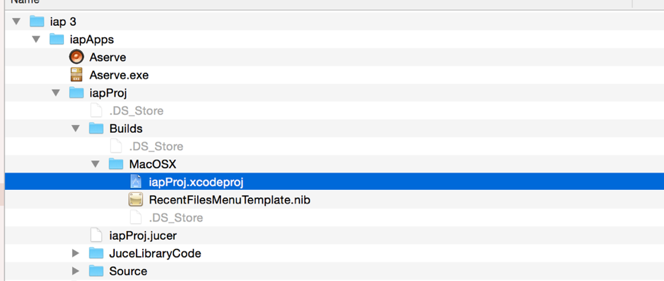

# Getting Started

Welcome to IAP (Introductory audio programming)

## About IAP

Programmed electronic devices are abundant in every sector of the music industry. In whichever area you choose to focus your studies - in the creation or use of audio technology - an intimate understanding of the inner workings of these devices will naturally enhance your abilities. 

Throughout this module you will learn important fundamental programming skills and concepts by writing programs that perform audio and music related tasks. 

## Weekly tasks

Each week there will be a practical session, a lecture, and a Peer Assisted Learning (PAL) session. A register will be taken at every timetabled session and attendance is compulsory. A new programming concept will be explored each week and exercised in the C++ programming language. 

Each weekly practical session has a specific set of sheets with instructions, information and exercises which **must** be completed before the following week. It is very important that all exercises are completed in the intended order as the material is incremental; that is, each practical builds upon the last. 

**It is very easy to fall behind if sessions are missed! Poor attendance often results in poor grades. The secret here to passing this module (and achieving a state of music tech bliss) is to follow the schedule week-by-week!**

## Getting the tools

### OSX Users

Download the IAP folder (which contains all of the required materials and applications)

https://github.com/Sjhunt93/IAP-2019-2020

You will also need to download the latest Xcode version and the Command Line Tools from here: (Note this is only if you are working on your own machine. The university machines already have xcode installed.

https://developer.apple.com/xcode/

To do this you will have to join the developer network (at no cost) here: 

http://developer.apple.com/programs/register/

### Windows

Download this IAP folder (which contains all of the required materials and applications)

https://github.com/Sjhunt93/IAP-2019-2020/tree/windows

For windows users we recomend using Microsoft's Visual Studio 2017:

https://visualstudio.microsoft.com/thank-you-downloading-visual-studio/?sku=Community&rel=15

## Opening Xcode

You will be developing software in the programming language C++ using the Apple Integrated Development Environment (IDE) called Xcode.

Once you have downloaded a copy of the project proceed to open the IAP folder, and follow the diagram below to open the project.

1. Double click on the file `iapProj.xcodeproj`
2. Wait for Xcode to open the project

Once the Xcode application has started:

3. Expand the folders on the left until you can see the file `IAP.cpp`
4. **Single click** on `IAP.cpp` to open it for editing. 

If you double-click by mistake, close the separate window that will appear, and try again. Ensure your Xcode window looks the same as the screenshot bellow. 

You can now start the practical sessions from <a href="Part%201/1%20-%20Familiarisation.md">Tutorial 1 - familiarisation</a>

