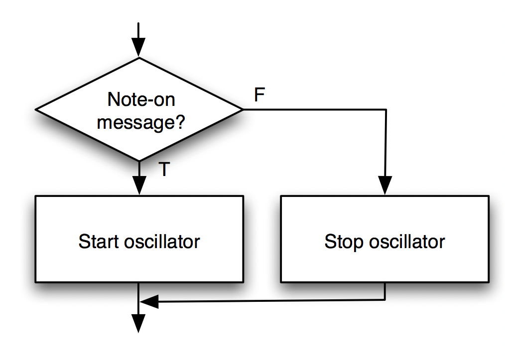
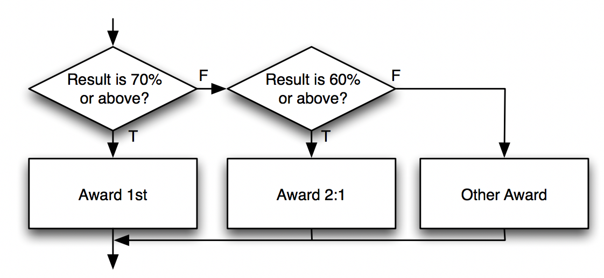

# Tutorial 4 – Flow Control

In this practical we will learn how to control program flow using 'if' statements. By the end of this practical you should understand: 

1.	How to set up and use a simple if statement.
2.	How to construct conditional expressions using comparison operators.
3.	How to set up and use simple if..else statements.
4.	How to set up and use nested if..else if statements.


## Videos

Please use the following videos for help during this session:

### Aserve Programming 3 - sample playback

[](http://www.youtube.com/watch?v=3wzw3ZkkdVM)

### If statements

[](http://www.youtube.com/watch?v=dvdHsb7Kndk)


## Flow Control

So far we have explored event driven programming, but we have used the same code each time an event happens. Often, you'll want to design programs that react to events in different ways depending on *conditions*. For example, in real life we turn lights on when outside is dark, and turn them off when outside is light. We can represent this in code using if statements.

The general form of the basic if statement is as follows: 

```cpp
if (condition) 
{ 
// do this code
}
```

If the condition is true then the statements enclosed by braces are executed, and if the condition is false the statements are skipped. 

## Conditions 

Comparison operators may be used to construct a *conditional* expression. For example, we may wish to display a warning if the temperature of a boiler exceeds 99 degrees centigrade. If the current temperature was stored in a variable called 'temp' the corresponding if statement would be as follows: 

```cpp
if(temp > 99)
   {
       std::cout << "Warning boiler is BOILING\n";
   }
```

Similarly, if a message was to be displayed when temp was less than or equal to 0 degrees centigrade: 

```cpp
    if(temp <= 0 )
    {
        std::cout << "Warning boiler is FREEZING\n";
    }
```

It is important to note that should the temperature be between 1 and 99 then no message would get printed.

A complete list of comparison operators is provided bellow. Sometimes these are called "relational operators" because they determine the relationship between two values.


| Operator | Meaning | Example |
| --- | --- | --- |
| > | Greater than | X > Y
| < | Less than | X < Y
| >= | Greater than or equal to |	X >= Y
| <= | Less then or equal to | X <= Y
| == | Equal to (different to assignment =) | X == Y
| != | Not equal to |	X != Y

Variables or literals (explicit values) may be used within a conditional expression.
In the examples above, the variable 'temp' was used with the literal '0' and the literal '99'.

## Exercise 1: Selective monophonic synth 

Reload your solution to exercise 3 from practical 3. Ensure that you use both the `IAP.h` and `IAP.cpp` files. 

**If you have not yet completed practical 3, please ensure you do.**

Modify the if statement to only play an oscillator when the input note is above 60.

## What else?

Often it is desirable to perform one action when a condition is true and another when it is false. For example, when withdrawing money from a cash machine, the underlying program will check that there are sufficient funds in the account before issuing cash, otherwise an error message is displayed. 

The general form of the basic if..else statement is as follows: 

```cpp
    if(condition)
    {
        //code block 1
    }
    else
    {
        //code block 2
    }
```

If the outcome of the condition is true (i.e. not zero) then code block 1 will be executed. If the condition is false then code block 2 will be executed. 

## Exercise 2:  Monophonic synth on/off State

Building on exercise 1. Use an if-else statement to switch the oscillator on if the velocity received is above 0, else switch the oscillator off. You will no longer need the if statement from exercise 1.

 The flow chart for this is given bellow:



### If and else if

Sometimes it is desirable to check for one of multiple possible conditions. For example, you may create a system that classifies university degree results from an overall percentage. A flow chart for this selection structure is provided below. Note that only one of these outputs is choosen.




This is typically called an "if..else..if statement" or an "else if statement" because the general form of the code is as follows: 

```cpp
    if(condition1)
    {
        //code block 1
    }
    else if (condition2)
    {
        //code block 2
    }
    else
    {
        //code block 3
    }
```
If the outcome of condition 1 is true then code block 1 is executed. If the outcome of condition 1 is false then condition 2 is tested and if found to be true then code block 2 is executed, if both condition 1 and condition 2 are false then code block 3 is executed. **Only one code block is executed.** 

## Exercise 3: Sampler

To demonstrate using if/else if/else we will construct a basic drum pad sampler.

<a href="../../Code%20Exercises/Tutorial%204/Exercise%203">Download both files</a>, and copy the contents into both `IAP.cpp` and `IAP.h` files.

You will see one new line of code that we have not seen before inside our run() function.

```cpp
aserveLoadDefaultSounds();
```
This call to Aserve will ask it to load up its default sample sounds.
The steps to complete this exercise are as follows:

1.	Write code that prints the incoming note number, to find out which note numbers each drum pad produces.
2.	Add an if statement to trigger sample playback, you must write the correct note number on the right hand side of the == operator.

```cpp
if (note == ) {
  aservePlaySample(0, 1.0);
}
```
3.	Next add "else if" statements for 3 other pads
4.	In total you should have 1 if statement, followed by 3 else if statements. You may add an optional else statement to print a help message telling the user which pads to press if you wish. 

aservePlaySample() is used to trigger sample playback in Aserve. The first argument specifies the sample channel to playback. The second argument is the volume to play the sample at, just like the oscillators it has a range from 0 to 1.0. There are 4 channels, starting with 0 and ending with 3 inclusively. Calling aservePlaySample(4, 1.0) is not valid.

Once you have finished this exercise you will find that the sample will trigger on both pushing the pad down and releasing it. Lets fix this, but first we need to learn one more concept.

## Nested if statements

On occasions were a more complex decision making process is required, we can place if structures inside other if structures. This is called "nesting". For example:

```cpp
if (time < 1800) 
{
  if (tiredness > 1.0) 
  {
    std::cout << "Drink Coffee! \n";
  }
  else 
  {
  std::cout << "Drink water! \n";
  }
}
else if (time > 2000) 
{
  if (tiredness > 1.0) 
  {
    std::cout << "Go To Sleep! \n";
  }
  else 
  {
    std::cout << "Drink Tea! \n";
  }
}
```

## Exercise 4: Fixing the drum sampler

The drum sampler has an error. The code we've written so far will trigger sample playback when a pad is pushed and when a pad is released.

To fix our drum sampler we need to apply the following logic.
```cpp
if (note is on) 
{
  //if structure from exercise 3.
}
```
Your drum sampler should now only trigger samples when the pad is pushed down. 

## Debug & Challenge Exercise

Open up the <a href="../../Code%20Exercises/Tutorial%204/Debug">debug folder</a> for this practical. Load both `IAP.cpp` and `IAP.h` files into the project. You must fix the program so that it runs a basic monophonic synth correctly. 

Issues include typos, numerical errors, out of range numbers and others. Make sure you save your solution for this to CodeBook.


## Important Material

Knowledge of the following will be assumed in next week’s practical:

1.	Simple if statements.
2.	Conditional expressions with comparison operators.
3.	Simple if..else statements. 
4.	Nested if..else if statements. 
5.	Trigger samples with Aserve
